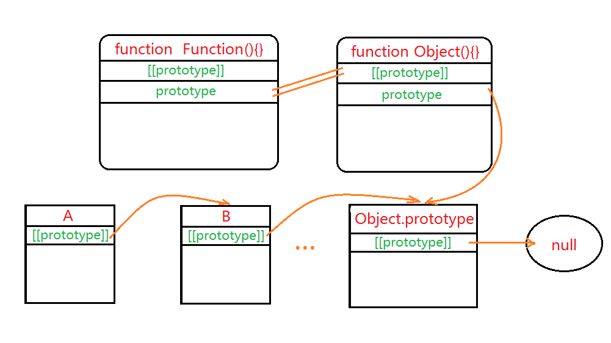
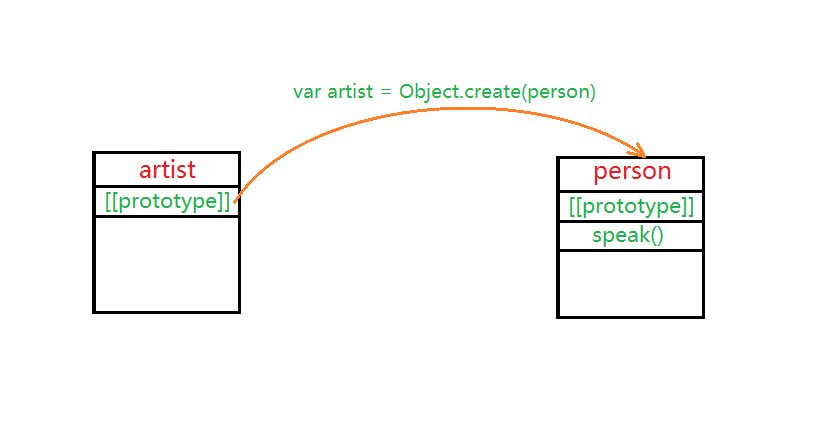
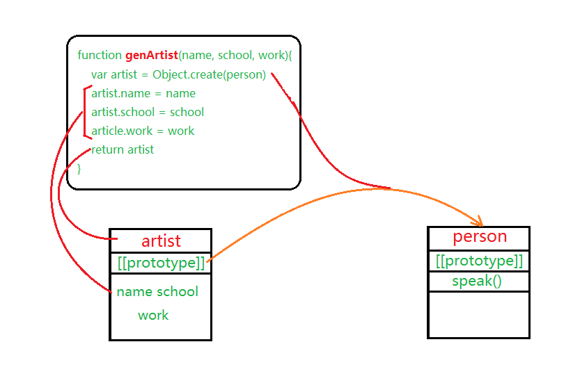
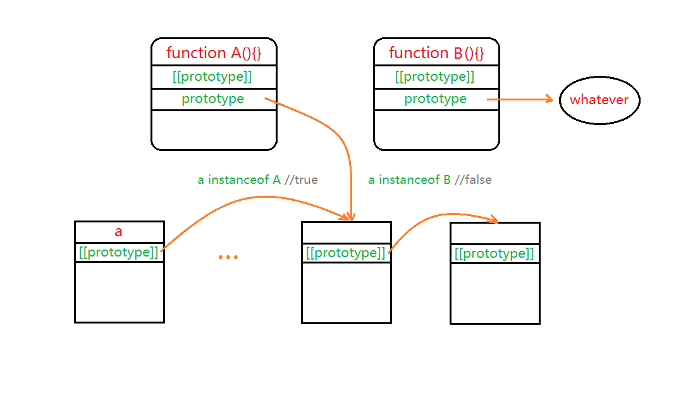
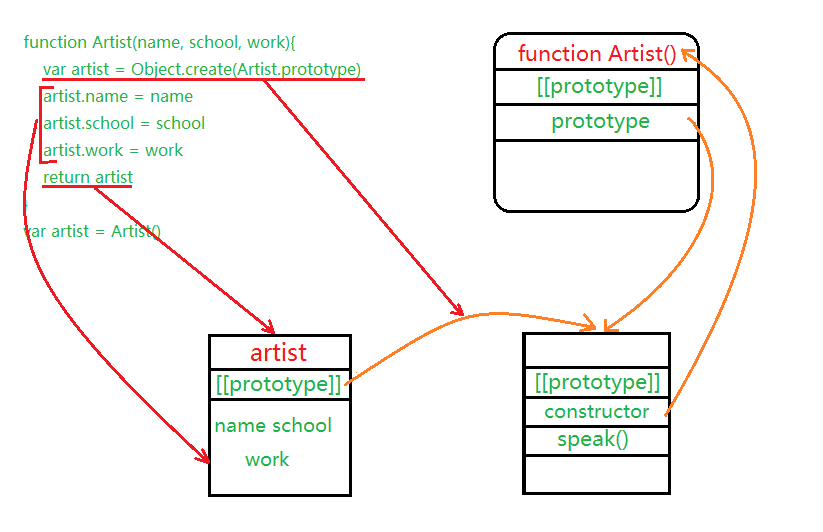

2023/12/15

这篇文章主要的目的是试图说清楚Javascript的原型继承机制，从9月开始写，断断续续，费心费力画了很多<del>精美的</del>图示，但是一不小心全删掉了，只好从新开始。

继承是为了实现方法的复用，如何实现方法的复用呢？最容易想到的，就是：

```js
//mixin
function extend(optional, base){
    for(var prop in base){
        if(!prop in optional){
            optional[prop] = base[prop]
        }
    }
    
    return optional
}
```

这种方法俗称`mixin`，它直接从甲对象复制方法和属性和方法到乙对象，乙对象就拥有了甲对象的功能，简单粗暴，易于理解。但是它有一个缺点，就是性能低下，浪费空间，因为每次扩展时都要复制一遍。那么，有没有更优雅的继承方法呢？

当然有。

实际上，`Javascript`天然内置了一种更优雅简单的方法，这就是人们耳熟能详的`prototype`原型链机制，该机制的内容可以描述为：

> 每一个对象内部都有一个`[[prototype]]`属性，该属性是一个指针，当对对象进行取值操作时，如果没有找到，则会尝试从该指针所指向的对象（即该对象的原型）中去查找，如果还没有找到，则会继续它的原型的原型中去查找，这个过程会一直持续下去，直到终点—— `Object.prototype`。

也可以简单图示为：



这种对象扩展的方法十分清新，如果想要乙对象从甲对象扩展方法，只要直接把乙对象的`[[prototype]]`属性指向甲对象即可。也就是说，`prototype`机制是一种在对象层面上的方法复用实现方式，它的思想很简单。而在经典的类式继承语言中，实现继承需要创建父类，然后创建子类继承父类，再实例化子类。

```
//pseudo code
class A{}
class B extends A{}
B foo = new B()
```
令人感到不可思议的是，虽然原型机制是`Javascript`式继承的基石，但在`ECMAScript5`发布以前，`Javascript`竟然并没有提供可以把一个对象的`[[prototype]]`指针指向另一个对象的`API`，反而是用一种十分奇怪的方式模拟了典型类式语言的语法，也就是大家耳熟能详的构造函数和`new`。构造函数和`new`很好地满足了一些程序员对于经典类式语法的追求，但它掩盖了很多细节和原理，容易让人产生误解，这里暂且按下不表。

要实现纯`Javascript`原型式的继承，直接设置`[[prototype]]`指针的`API`是不可或缺的。一些浏览器给对象暴露了一个可读可写的`__proto__`属性，可以用来设置对象的`[[prototype]]`指针，而`ES5`终于提供了一个`Object.create()`的方法，用于设置`[[prototype]]`指针。

使用`Object.create()`方法，可以轻松实现纯`Javascript`式继承，例如：

```js
var person = {
    speak: function(what){
        console.log(what)
    }
}
var artist = Object.create(person)

//I am an artist
artist.speak('I am an artist')
```

`artist`对象由`Object.create(person)`创建而来，因此它内部的`[[prototype]]`指针就指向`person`，当我们查询它的`speak`属性时，在它本身上找不到，于是就自动到它的原型上去查询。整个过程可以图示如下：



这是一种轻量、简洁、易于理解的继承方式，我们可以随便创建新的`artist`对象，让它继承`person`，如果需要给所有的`artist`添加新的方法，只需在`person`添加就可立即生效。

但是这种简单的机制也不是没有缺点。`person`上的属性是被所有的`artist`共享的。在现实世界中，每个`artist`有一些独特的不能和他人共享的属性，比如，他的姓名、流派、代表作等等，于是我的代码可能要改成这样：

```js
//公共属性写在原型上
var person = {
    speak: function(){
        return this.name
    }
}

//创建对象
var artist = Object.create(person)

//自己的属性
artist.name = 'Leonardo da Vinci'
artist.school = 'classical'
artist.works = ['Mona Lisa']

```

但是，每次创建一个`artist`对象都要写这么一大串，我们最好把这个创建的过程用一个函数封装起来，即：

```js
var person = {
    getName: function(){
        return this.name
    }
}

function genArtist(name, school, work){
    //设定原型
    var artist = Object.create(person)

    //自有的属性    
    artist.name = name
    artist.school = school
    article.work = work
    
    return artist
}

var vinci = genArtist('Leonardo da Vinci', 'classical', 'Mona Lisa')

//Leonardo da Vinci
console.log(vinci.speak())
```

现在每次通过`genArtist`函数创建新的`artist`时，返回的对象既会生成它自己的独有属性，又会继承`person`的属性。因为新生成的对象的`[[prototype]]`指向了`person`对象。整个`genArtist`函数就是一个批量生产`artist`对象的__工厂__，这个过程可以图示如下：



至此我们已经创建了一个相当令人满意的纯`Javascript`式的对象生成方法：通过函数统一生成一类对象、生成的对象共享原型方法，如果我们愿意，还可以把`person`的`[[prototype]]`指向另一个对象，延长原型链。

但是这个方法也有一个缺点，我们不能利用`instanceof`操作符来检测它属于哪一类，`instanceof`检测的原理是：

> 如果一个函数的`prototype`指针指向的对象和一个对象的原型链上的任何一个对象相同，则返回`true`。



工厂函数方法生成的对象的`[[prototype]]`被指定为一个其他对象，即`person`，并没有指向哪个函数的`prototype`，所以`instanceof`就不可用。那么我们最好来指定一下。（值得注意的是__函数的`prototype`指针__，极易与__对象的`[[prototype]]`指针__混淆，前者是每个函数对象都带有的一个属性，作用是作为通过这个函数`new`出来的对象的`[[prototype]]`指针的目标。当然，因为一切皆对象，函数本身作为一个对象，它内部自然也有一个`[[prototype]]`指针，如上面的第一张图所示。）

```js
function Artist(name, school, work){
    //important
    var artist = Object.create(Artist.prototype)
    
    artist.name = name
    artist.school = school
    artist.work = work
    
    return artist
}

var artist = Artist()
console.log(artist instanceof Artist) //true
```

现在生成的对象的`[[prototype]]`指向了函数`Artist`的`prototype`，`instanceof`终于可以用了。问题又来了：`person`被我们丢掉了，`person`上添加了一些所有对象共用的方法，不能丢掉。但是想想，既然现在所有生成对象的`[[prototype]]`都指向了`Artist.prototype`，那我们直接在`Artist.prototype`上扩展不就好了吗？

```js
Artist.prototype.speak = function(){
    return this.name
}
```

到这一步，你会发现这和构造函数的写法已经十分类似了。是的，我们一步一步完全实现了`new`和构造函数所达到的所有效果。不同的是，我们的实现中，没有任何黑盒子，每一步都很清晰。上面的过程，用`new`和构造函数__等价__改写一下，大概是像下面这样的：

```js
function Artist(name, school, work){
    this.name = name
    this.school = school
    this.work = work
}

var artist = new Artist()

console.log(artist instanceof Artist) //true
```



构造函数和前面的工厂函数在效果上是等价的，但它们的写法却有下面几个不同点：

1. 构造函数没有显式指定生成对象的`[[prototype]]`。

2. 构造函数没有返回一个对象。

3. 构造函数调用需要加关键字`new`。

这说明，加关键字`new`调用构造函数，背后会自动为你完成1、2两步，背后干了这么多事情，都被浓缩到一个__`new`魔法__里面了，也难怪会让很多人困惑。